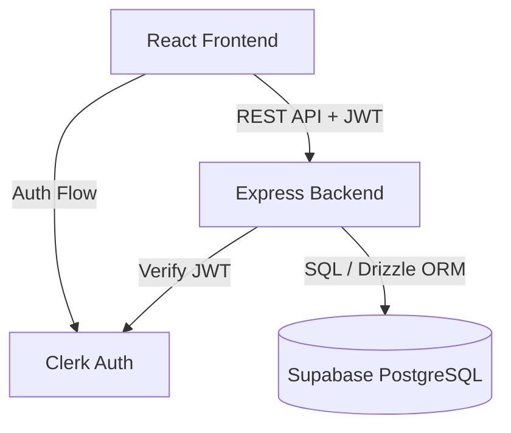

# System Architecture

## 1. High-Level Architecture
Vibelearn uses a modern decoupled Client-Server architecture.

## 2. Tech Stack

### Frontend
- **Framework:** React (bootstrapped with Vite)
- **Styling:** Tailwind CSS
- **Authentication:** Clerk React SDK
- **Deployment:** Vercel

### Backend
- **Framework:** Node.js with Express.js
- **Database ORM:** Drizzle ORM
- **Authentication:** Clerk Express SDK (JWT validation)
- **Deployment:** Render

### Database
- **Provider:** Supabase (PostgreSQL)

## 3. System Design Decisions
- **Decoupled Repositories/Folders:** Frontend and backend are separated into distinct folders to allow independent deployments to Vercel and Render.
- **Authentication Flow:** The frontend handles user login via Clerk and receives a session JWT. When making requests to the backend (e.g., saving progress), the frontend attaches the JWT in the Authorization header. The Express backend verifies the JWT using Clerk's middleware before allowing access to protected endpoints.
- **Data Fetching:** The React frontend fetches course data and submits progress updates via standard HTTP requests to the Express backend.
- **No TypeScript:** The entire codebase (both frontend and backend) must be written in standard JavaScript. TypeScript is strictly prohibited.
- **No Containerization:** The application will be deployed directly via Vercel and Render native runtimes. Docker, Kubernetes, or any other containerization tools must NOT be used.
