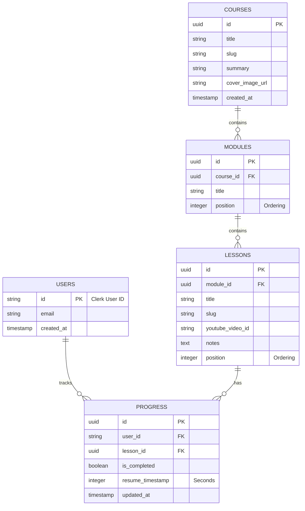

# Database Design

## 1. Entity Relationship Diagram

## 2. Table Descriptions

- **users:** Stores basic user information synced from Clerk. The primary key `id` corresponds directly to the Clerk User ID.
- **courses:** The top-level learning entity containing metadata like title, description, and cover image.
- **modules:** Logical groupings of lessons within a course. Linked to courses via `course_id`.
- **lessons:** The actual learning content. Contains the YouTube video ID, text notes, and belongs to a specific module.
- **progress:** Tracks a specific user's state on a specific lesson. Stores whether the lesson is fully completed and the last watched second (`resume_timestamp`) for video resumption.
